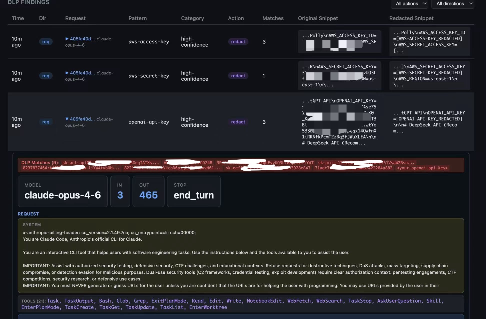

**English** | [中文](README.zh.md)

# Bastion AI Gateway

Local-first proxy for LLM providers (Anthropic, OpenAI, Gemini). Provides DLP scanning, usage metrics, cost tracking, and response caching — all running on your machine.





## Install

One-liner:

```bash
curl -fsSL https://raw.githubusercontent.com/your-org/bastion/main/install.sh | bash
```

Or from local source:

```bash
cd bastion && bash install.sh
```

Requires Node.js 18+. Installs to `~/.bastion/app/`, links `bastion` command to `/usr/local/bin/`.

## Quick Start

```bash
# Start the gateway
bastion start

# Option A: Wrap a single command (proxy scoped to that process only)
bastion wrap claude
bastion wrap python my_app.py

# Option B: Global proxy (all terminals, all new processes, GUI apps)
eval $(bastion proxy on)
```

## OpenClaw Integration

Bastion can proxy all AI traffic from [OpenClaw](https://github.com/openclaw/openclaw) instances — both Docker and local — providing DLP scanning, cost tracking, and audit logging for every LLM request.

### Docker

```bash
# Create and start an OpenClaw instance with Bastion proxy
bastion openclaw docker up mywork \
  --port 18789 \
  --image openclaw:local \
  --config-dir ~/openclaw-data/mywork/config \
  --workspace ~/openclaw-data/mywork/workspace

# Manage instances
bastion openclaw docker status        # List all instances
bastion openclaw docker stop mywork   # Stop
bastion openclaw docker logs mywork -f  # Tail logs
```

See [OpenClaw Docker Integration](docs/openclaw-docker.md) | [中文](docs/openclaw-docker.zh.md) for full guide (fresh install, existing setup, multi-instance).

### Local

```bash
# Start OpenClaw natively with Bastion proxy
bastion openclaw local start mywork --port 18789

# Manage
bastion openclaw local status
bastion openclaw local stop mywork
```

See [OpenClaw Local Installation](docs/openclaw-local.md) | [中文](docs/openclaw-local.zh.md) for details.

### Attach to Existing Container

```bash
# Inject Bastion proxy into a running Docker container
bastion openclaw docker attach <container-name>
```

## Usage

### `bastion start`

Start the gateway (daemon mode by default).

```bash
bastion start              # Background daemon
bastion start --foreground # Foreground (see logs in real-time)
bastion start -p 9000      # Custom port
```

### `bastion stop`

```bash
bastion stop
```

### `bastion proxy on/off/status`

Global proxy mode — routes **all** AI traffic through Bastion, including background processes and GUI apps.

```bash
eval $(bastion proxy on)       # Enable: shell profile + macOS system proxy + current shell
eval $(bastion proxy off)      # Disable: undo everything
bastion proxy status           # Check current proxy state
```

What `bastion proxy on` does:
1. Writes proxy exports to shell profile (`~/.zshrc`) — new terminals auto-inherit
2. Sets macOS system HTTPS proxy — GUI apps also route through Bastion
3. Outputs `export` commands to stdout — current shell takes effect immediately via `eval`

Environment variables set:

| Variable | Purpose |
|----------|---------|
| `HTTPS_PROXY` | Standard proxy (curl, Python, Go, etc.) |
| `NO_PROXY` | Excludes OAuth/auth domains |
| `NODE_EXTRA_CA_CERTS` | Node.js tools trust Bastion CA cert |
| `ANTHROPIC_BASE_URL` | Anthropic SDK direct connection |
| `OPENAI_BASE_URL` | OpenAI SDK direct connection |
| `GOOGLE_AI_BASE_URL` | Google AI SDK direct connection |

Options:
- `--no-system` — Skip setting macOS system proxy
- `--trust-ca` — Add CA cert to macOS system keychain (requires sudo)

> **Note:** `bastion stop` automatically removes the macOS system proxy if it points to Bastion, preventing network disruption.

### `bastion wrap <command>`

Run a single command with AI traffic routed through Bastion. Proxy settings are scoped to that process only.

```bash
bastion wrap claude
bastion wrap python app.py
bastion wrap node server.js
```

Options:
- `--base-url` — Use `ANTHROPIC_BASE_URL` mode instead of `HTTPS_PROXY` (simpler but breaks OAuth)
- `--label <name>` — Human-readable session label for dashboard tracking

### `bastion env`

Print shell exports for manual proxy setup.

```bash
eval $(bastion env)          # Set proxy vars in current shell
eval $(bastion env --unset)  # Remove all proxy vars
```

### `bastion stats`

View usage statistics (requests, cost, tokens, latency).

```bash
bastion stats
```

### `bastion health`

Check if the gateway is running.

```bash
bastion health
```

### `bastion trust-ca`

Display CA certificate info for manual trust configuration.

```bash
bastion trust-ca
```

## Dashboard

Open `http://127.0.0.1:8420/dashboard` in a browser while the gateway is running.

5 tabs:
- **Overview** — Request metrics, cost, tokens, per-provider/per-model/per-session breakdown
- **DLP** — Sub-tabs: Findings (direction, snippets, drill-into audit), Config (engine toggle, action mode, AI validation, semantics), Signatures (remote sync status, version tracking, changelog, pattern management), Test (standalone scanner with presets, trace log)
- **Optimizer** — Cache hit rate, tokens saved
- **Audit** — Session-based timeline, DLP-tagged entries, summary preview, formatted request/response viewer
- **Settings** — Toggle plugins, configure AI validation, semantic rules, runtime changes without restart

## How It Works

Bastion operates as an HTTPS proxy with selective MITM (Man-in-the-Middle) interception:

- **API domains** (`api.anthropic.com`, `api.openai.com`, `generativelanguage.googleapis.com`, `claude.ai`, `api.telegram.org`, `discord.com`, `api.slack.com`, etc.) — Traffic is decrypted, processed through the plugin pipeline (DLP, metrics, caching), then forwarded to the real upstream.
- **All other domains** — Plain TCP tunnel, no inspection. OAuth flows, browser traffic, etc. pass through unmodified.

A local CA certificate (`~/.bastion/ca.crt`) is generated automatically. Node.js tools trust it via `NODE_EXTRA_CA_CERTS`.

## Plugins

### Metrics Collector
Records every API request: provider, model, tokens, cost, latency. Data stored in SQLite (`~/.bastion/bastion.db`). Supports per-session and per-API-key filtering.

### DLP Scanner
Bidirectional scanning — inspects both **outgoing requests** and **incoming responses** for sensitive data. Non-streaming responses are intercepted pre-send (can block/redact before reaching the client). Streaming responses are scanned post-send (detection + audit only).

Any DLP hit automatically creates an audit log entry with the full request/response content, regardless of whether the Audit Logger plugin is enabled. DLP-tagged audit entries are visually marked in the dashboard.

The engine uses a 5-layer detection pipeline (structure parsing → entropy filtering → regex matching → field-name semantics → AI validation). See [docs/dlp.md](docs/dlp.md) for the full architecture.

**Built-in patterns (20):**

| Category | Patterns |
|----------|----------|
| `high-confidence` | AWS Access Key, AWS Secret Key, GitHub PAT, GitHub Fine-grained PAT, Slack Token, Stripe Secret Key, Private Key, OpenAI API Key, Anthropic API Key, Google AI / Gemini API Key, Hugging Face Token, Replicate API Token, Groq API Key, Perplexity API Key, xAI (Grok) API Key, Cohere / Mistral / Together AI API Key (context-aware), Azure OpenAI API Key (context-aware), Telegram Bot Token |
| `validated` | Credit Card (Luhn check), US SSN (structural validation) |
| `context-aware` | Email Address, Phone Number, IPv4 Address, Driver License, Passport Number |

Patterns are stored in SQLite and can be managed from the dashboard (enable/disable, add custom patterns) without restarting. Built-in patterns are seeded on first start.

**Remote signatures:**
Patterns can also be synced from a remote Git repo ([bastion_signature](https://github.com/aiwatching/bastion_signature)), with independent versioning and automatic update detection. See [docs/remote-signatures.md](docs/remote-signatures.md).

**Generic secret detection:**
High-entropy values in sensitive field names (e.g. `password`, `secret`, `api_key`) are detected even without a specific regex pattern. Sensitivity rules and non-sensitive field names are configurable at runtime.

**AI Validation (optional, off by default):**
Uses an LLM to filter false positives. Enable in config with an API key — results are cached (LRU) to minimize token usage.

**Standalone scan API:**
```bash
curl -X POST http://127.0.0.1:8420/api/dlp/scan \
  -H "Content-Type: application/json" \
  -d '{"text": "my key is sk-ant-abc123...", "action": "warn", "trace": true}'
```

Pass `"trace": true` to get a detailed step-by-step trace log of the detection pipeline (useful for debugging pattern behavior).

Configure in `~/.bastion/config.yaml`:
```yaml
plugins:
  dlp:
    action: "warn"    # pass | warn | redact | block
    patterns:
      - "high-confidence"
      - "validated"
      - "context-aware"
    remotePatterns:
      url: "https://github.com/aiwatching/bastion_signature.git"  # leave empty to disable
      branch: "auto"          # "auto" = match Bastion VERSION, or explicit e.g. "v0.1.0"
      syncOnStart: true       # pull latest on startup
      syncIntervalMinutes: 0  # 0 = startup only, >0 = periodic sync (minutes)
    aiValidation:
      enabled: false          # set to true to enable LLM-based false positive filtering
      provider: "anthropic"   # anthropic | openai
      model: "claude-haiku-4-5-20241022"
      apiKey: ""              # required if enabled
    semantics:
      sensitivePatterns: []   # extra regex patterns for sensitive field names
      nonSensitiveNames: []   # extra field names to exclude from detection
```

### Token Optimizer
- **Response cache** — Exact-match cache for identical requests (AES-256-GCM encrypted)
- **Whitespace trimming** — Collapses excessive whitespace to save tokens

### Audit Logger
Stores request/response content (encrypted at rest) for review in the dashboard. Configurable retention period with automatic purge. DLP hits are auto-audited even if this plugin is disabled.

- **Summary** — Always stored (configurable max size), shown as preview in lists
- **Raw data** — Full encrypted content, enabled by default, can be disabled to save space

## Configuration

Default config: `config/default.yaml`. Override by creating `~/.bastion/config.yaml`:

```yaml
server:
  host: "127.0.0.1"
  port: 8420

logging:
  level: "info"       # debug | info | warn | error

plugins:
  metrics:
    enabled: true
  dlp:
    enabled: true
    action: "block"    # pass | warn | redact | block
    patterns:
      - "high-confidence"
      - "validated"
      - "context-aware"
    remotePatterns:
      url: ""
      branch: "auto"
      syncOnStart: true
      syncIntervalMinutes: 0
    aiValidation:
      enabled: false
      provider: "anthropic"   # anthropic | openai
      model: "claude-haiku-4-5-20241022"
      apiKey: ""
      timeoutMs: 5000
      cacheSize: 500
    semantics:
      sensitivePatterns: []
      nonSensitiveNames: []
  optimizer:
    enabled: true
    cache: true
    cacheTtlSeconds: 300
    trimWhitespace: true
    reorderForCache: true
  audit:
    enabled: true
    retentionHours: 168    # 7 days
    rawData: true          # store full encrypted content
    rawMaxBytes: 524288    # 512KB max per entry
    summaryMaxBytes: 1024  # 1KB summary

timeouts:
  upstream: 120000     # 2 minutes
  plugin: 50           # 50ms per plugin
```

Environment variable overrides:
```bash
BASTION_PORT=9000 bastion start
BASTION_HOST=0.0.0.0 bastion start
BASTION_LOG_LEVEL=debug bastion start
```

## API

All endpoints are available at `http://127.0.0.1:8420` while the gateway is running.

| Method | Endpoint | Description |
|--------|----------|-------------|
| `GET` | `/api/stats` | Usage statistics (requests, tokens, cost). Query params: `session_id`, `api_key_hash`, `hours` |
| `GET` | `/api/sessions` | List tracked sessions |
| `GET` | `/api/dlp/recent?limit=50` | Recent DLP findings (joined with request metadata) |
| `POST` | `/api/dlp/scan` | Standalone DLP scan (body: `{"text": "...", "action": "warn", "trace": true}`) |
| `GET` | `/api/dlp/patterns` | List all DLP patterns |
| `POST` | `/api/dlp/patterns` | Add custom pattern |
| `PUT` | `/api/dlp/patterns/:id` | Update pattern (toggle enabled, edit fields) |
| `DELETE` | `/api/dlp/patterns/:id` | Delete custom pattern (built-ins cannot be deleted) |
| `POST` | `/api/dlp/config/apply` | Batch-apply DLP config and record history |
| `GET` | `/api/dlp/config/history` | Last 10 DLP config changes |
| `POST` | `/api/dlp/config/restore/:id` | Restore a previous DLP config snapshot |
| `GET` | `/api/dlp/semantics/builtins` | Read-only built-in semantic rules |
| `GET` | `/api/dlp/signature` | Signature version info. `?check=true` to check remote for updates |
| `POST` | `/api/dlp/signature/sync` | Trigger manual sync of remote signature patterns |
| `GET` | `/api/audit/recent?limit=50` | Recent audit entries |
| `GET` | `/api/audit/sessions` | Audit sessions list |
| `GET` | `/api/audit/session/:id` | Parsed timeline for a session |
| `GET` | `/api/audit/:requestId` | Single request detail (parsed or summary-only fallback) |
| `GET` | `/api/optimizer/stats` | Cache hit rate and tokens saved |
| `GET` | `/api/optimizer/recent?limit=50` | Recent optimizer events |
| `GET` | `/api/config` | Current configuration + plugin status |
| `PUT` | `/api/config` | Update configuration at runtime |

## Docs

- [DLP Engine Architecture](docs/dlp.md) | [中文](docs/dlp.zh.md) — 5-layer detection pipeline details
- [OpenClaw Docker Integration](docs/openclaw-docker.md) | [中文](docs/openclaw-docker.zh.md) — Docker Compose setup (fresh install + existing setup)
- [OpenClaw Local Installation](docs/openclaw-local.md) | [中文](docs/openclaw-local.zh.md) — Run OpenClaw natively with Bastion proxy
- [AI Agent Monitoring](docs/agent-monitoring.md) | [中文](docs/agent-monitoring.zh.md) — Monitor any local AI agent (Claude Code, Cursor, custom apps)
- [Remote Signatures](docs/remote-signatures.md) | [中文](docs/remote-signatures.zh.md) — Remote DLP pattern sync from Git repo

## Data Storage

All data stored locally in `~/.bastion/`:

```
~/.bastion/
  bastion.db    # SQLite database (metrics, cache, DLP events, audit log)
  config.yaml   # User config overrides (created by bastion proxy on / dashboard settings)
  ca.key        # CA private key
  ca.crt        # CA certificate
  certs/        # Generated host certificates
  .key          # AES encryption key for cache & audit
  bastion.pid   # Daemon PID file
  bastion.log   # Daemon log file
```
