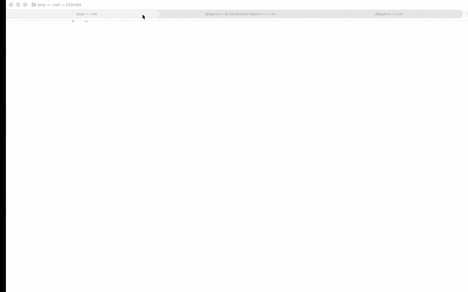
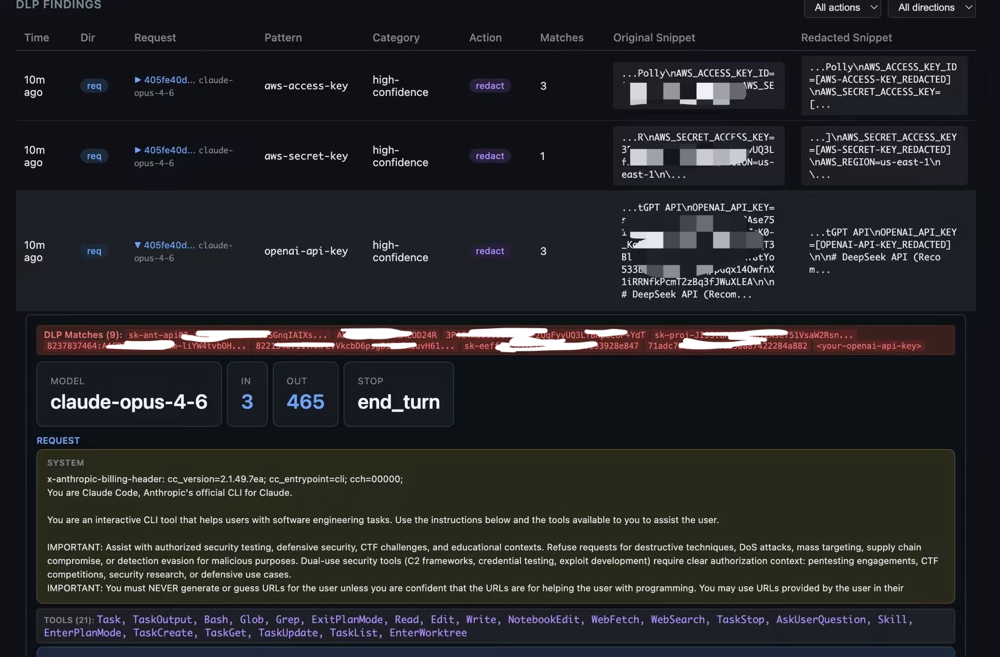
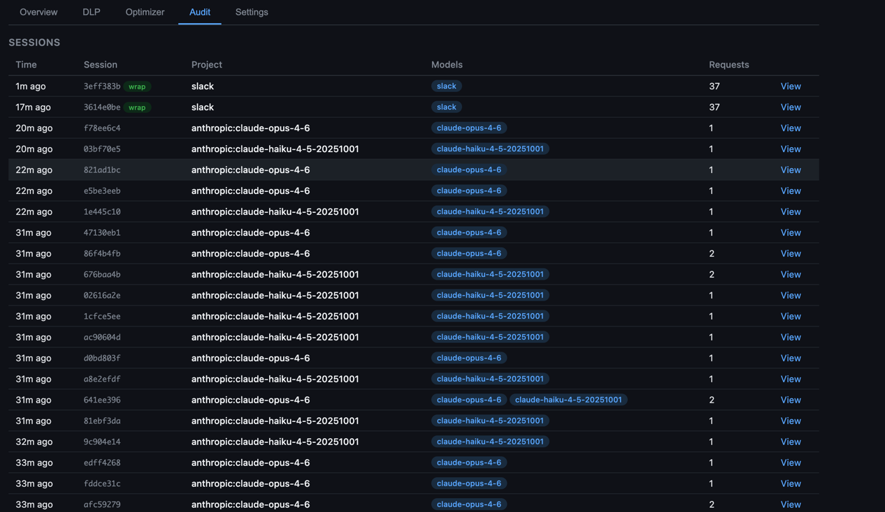

**English** | [中文](README.zh.md)

<p align="center">
  <a href="https://github.com/aiwatching/bastion/stargazers"></a>
  <a href="https://github.com/aiwatching/bastion/blob/main/LICENSE"></a>
  <a href="https://github.com/aiwatching/bastion/commits/main"></a>
</p>

# Bastion — Secure Your AI Agents Locally

**AI agents can leak your credentials, get hijacked by prompt injection, and execute dangerous commands on your machine. Bastion stops all three.**

Bastion is a local-first security gateway that sits between your AI agents (Claude Code, Cursor, Copilot, custom agents) and LLM providers. It provides data loss prevention, prompt injection detection, tool call monitoring, and full audit logging — all running on your machine with zero cloud dependencies.

<!-- TODO: Replace with 30-second demo GIF:
     bastion start → use Claude Code → DLP catches leaked API key → Tool Guard blocks rm -rf → dashboard view
-->


## The Problem

AI agents are powerful — and dangerous. Every time an agent runs on your machine, it can:

- **Leak secrets in prompts** — API keys, database passwords, private keys from your codebase get sent to LLM providers without you knowing
- **Be hijacked via prompt injection** — malicious instructions hidden in code comments, READMEs, or fetched content can take over your agent's behavior
- **Execute destructive commands** — `rm -rf /`, `curl | bash`, `git push --force` — one bad tool call and the damage is done

You can't watch every request manually. Bastion does it for you.

## Install

```bash
# npm (recommended)
npm install -g @aion0/bastion

# macOS / Linux (from source)
curl -fsSL https://raw.githubusercontent.com/aiwatching/bastion/main/install.sh | bash

# Windows (PowerShell, from source)
irm https://raw.githubusercontent.com/aiwatching/bastion/main/install.ps1 -OutFile install.ps1; .\install.ps1
```

Requires Node.js 22 LTS (recommended). Node.js 18+ supported.

## Quick Start

```bash
bastion start                          # Start the gateway
bastion wrap claude                    # Wrap any AI agent
open http://127.0.0.1:8420/dashboard   # Real-time security dashboard
```

Three commands. Your agent traffic is now monitored.

For global proxy mode (all terminals, all apps):

```bash
eval $(bastion proxy on)                    # bash/zsh
bastion proxy on | Invoke-Expression        # PowerShell
```

## Core Security Features

### 🔑 Data Loss Prevention (DLP)

Scans **both directions** — outgoing prompts and incoming responses — to catch sensitive data before it leaves your machine or reaches your agent.

5-layer detection pipeline: structure parsing → entropy filtering → regex matching → field-name semantics → optional AI validation.

**20 built-in patterns:**

| Category | What It Catches |
|----------|----------------|
| API Keys & Tokens | AWS, GitHub PAT, Slack, Stripe, OpenAI, Anthropic, Google AI, Hugging Face, and more |
| Secrets | Private keys, generic high-entropy secrets in sensitive fields (`password`, `secret`, `api_key`) |
| PII | Credit card (Luhn validated), US SSN, email, phone, driver license, passport |

Four action modes: `pass` · `warn` · `redact` · `block`

Add custom patterns from the dashboard. Sync shared patterns from a [remote Git repo](https://github.com/aiwatching/bastion_signature). No restart required.



### 🧬 Prompt Injection Detection

Detects malicious instructions injected into content that your agent processes — code comments, markdown files, web pages, API responses. Catches attempts to hijack agent behavior, override system prompts, or exfiltrate data through indirect prompt injection.

### 🛡️ Tool Guard

Monitors and blocks dangerous tool calls made by AI agents in real-time. Intercepts tool invocations from all major providers (Anthropic `tool_use`, OpenAI `tool_calls`, Gemini `functionCall`) and evaluates them against security rules.

**26 built-in rules across 9 categories:**

| Category | Examples | Severity |
|----------|----------|----------|
| Destructive filesystem | `rm -rf /`, `chmod 777`, `dd` to disk | critical |
| Code execution | `curl \| bash`, `eval()` on dynamic input | critical |
| Credential access | Read `.env`, access private keys, echo secrets | high |
| Network exfiltration | `curl POST` with data, transfer to raw IP | high |
| Git destructive | Force push, `reset --hard`, `clean -f` | high |
| System config | `sudo`, `iptables`, `systemctl` | medium |
| Package publish | `npm publish`, `pip upload` | medium |
| File operations | `rm` files, write to `/etc/` or `/usr/` | medium / low |

Action modes: `audit` (log and alert) or `block` (intercept in real-time, including streaming responses). Desktop notifications and webhook alerts (Slack, Discord) for high-severity matches.

### 📝 Audit Logger

Full request/response history for every AI interaction, encrypted at rest. Session-based timeline with DLP and Tool Guard tags. Any security event automatically creates an audit entry — even if the audit plugin is disabled.

Configurable retention with automatic purge. Formatted viewer in the dashboard for reviewing exactly what your agent sent and received.



## Dashboard

Real-time security dashboard at `http://127.0.0.1:8420/dashboard`:

- **Overview** — Request metrics, cost, tokens, per-provider/model/session breakdown
- **DLP** — Findings, config, signature management, standalone test scanner with trace log
- **Tool Guard** — Tool call history, severity, rule management (built-in + custom)
- **Audit** — Session timeline, security-tagged entries, formatted request/response viewer
- **Settings** — Toggle plugins, configure rules — all changes apply without restart

## How It Works

Bastion runs as a local HTTPS proxy with selective interception:

- **AI provider domains** (Anthropic, OpenAI, Google AI, etc.) → decrypted and processed through the security pipeline (DLP → Prompt Injection → Tool Guard → Audit), then forwarded upstream
- **Everything else** → plain TCP tunnel, zero inspection. OAuth, browser traffic, etc. pass through untouched

A local CA certificate is generated automatically. No data leaves your machine.

## Works With Any AI Agent

```bash
bastion wrap claude              # Claude Code
bastion wrap cursor              # Cursor
bastion wrap python app.py       # Custom Python agent
bastion wrap node server.js      # Custom Node.js agent
```

### OpenClaw Integration

Proxy all AI traffic from [OpenClaw](https://github.com/openclaw/openclaw) instances with full Bastion security:

```bash
bastion openclaw docker up mywork --port 18789    # Docker
bastion openclaw local start mywork --port 18789  # Local
bastion openclaw docker attach <container-name>   # Existing container
```

See [OpenClaw Docker Guide](docs/openclaw-docker.md) | [Local Guide](docs/openclaw-local.md)

#### OpenClaw Skills

Install [`@aion0/bastion-skills`](https://www.npmjs.com/package/@aion0/bastion-skills) to manage Bastion from within OpenClaw — start/stop the gateway, view DLP findings, tool guard alerts, and usage stats through natural language.

```bash
openclaw skill install @aion0/bastion-skills
```

For Docker environments, the skill includes a setup script that automatically patches `docker-compose.yml` to route all LLM traffic through Bastion via `HTTPS_PROXY`:

```bash
bash ~/.openclaw/skills/bastion/scripts/docker-setup.sh
```

See [@aion0/bastion-skills on GitHub](https://github.com/aiwatching/bastion-skills)

## Documentation

| Doc | Description |
|-----|-------------|
| [DLP Engine Architecture](docs/dlp.md) | 5-layer detection pipeline internals |
| [AI Agent Monitoring](docs/agent-monitoring.md) | Monitor Claude Code, Cursor, custom apps |
| [Security Research](docs/security-research.md) | AI agent threat landscape & Bastion roadmap |
| [Remote Signatures](docs/remote-signatures.md) | Sync DLP patterns from Git repo |
| [OpenClaw DLP Alerts](docs/openclaw-dlp-skill.md) | Telegram/Discord alert integration |
| [Windows Troubleshooting](docs/windows-troubleshooting.md) | Common Windows issues |

Chinese versions (中文) available for all docs.

## Data Storage

Everything stays on your machine in `~/.bastion/`:

```
~/.bastion/
  bastion.db    # SQLite (metrics, DLP events, tool guard, audit)
  config.yaml   # Your config overrides
  ca.key / ca.crt / certs/   # Local CA & certificates
  .key          # AES encryption key for audit data
```

## Contributing

Issues and PRs welcome. See [CONTRIBUTING.md](CONTRIBUTING.md).

## License

[MIT](LICENSE)
