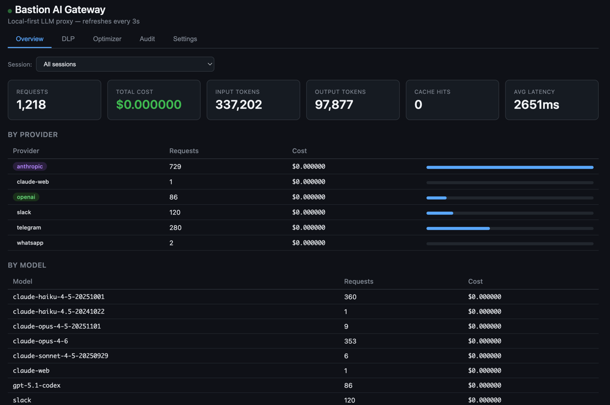
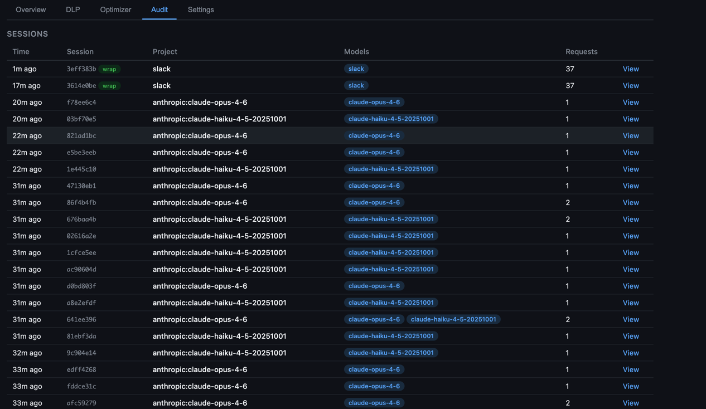

[English](README.md) | **中文**

# Bastion AI Gateway

本地优先的 LLM 提供商代理（Anthropic、OpenAI、Gemini）。提供 DLP 扫描、工具调用监控、使用量统计、费用追踪和响应缓存——全部在本机运行。







## 安装

### macOS / Linux

```bash
curl -fsSL https://raw.githubusercontent.com/aiwatching/bastion/main/install.sh | bash
```

或从本地源码安装：

```bash
cd bastion && bash install.sh
```

### Windows (PowerShell)

```powershell
powershell -ExecutionPolicy Bypass -File install.ps1
```

或从本地源码安装：

```powershell
cd bastion; powershell -ExecutionPolicy Bypass -File install.ps1
```

需要 **Node.js 22 LTS**（推荐）。Node.js 18+ 可用，但非 LTS 版本可能需要[额外配置](docs/windows-troubleshooting.zh.md#1-better-sqlite3-编译失败非-lts-nodejs)。安装至 `~/.bastion/app/`。

## 快速开始

```bash
# 启动网关
bastion start

# 方式 A：包裹单个命令（代理仅作用于该进程）
bastion wrap claude
bastion wrap python my_app.py

# 方式 B：全局代理（所有终端、所有新进程、GUI 应用）
eval $(bastion proxy on)          # bash/zsh
bastion proxy on | Invoke-Expression  # PowerShell
```

## OpenClaw 集成

Bastion 可以代理 [OpenClaw](https://github.com/openclaw/openclaw) 实例的所有 AI 流量（Docker 和本地均支持），提供 DLP 扫描、费用追踪和审计日志。

### Docker

```bash
# 创建并启动 OpenClaw 实例，自动配置 Bastion 代理
bastion openclaw docker up mywork \
  --port 18789 \
  --image openclaw:local \
  --config-dir ~/openclaw-data/mywork/config \
  --workspace ~/openclaw-data/mywork/workspace

# 管理实例
bastion openclaw docker status        # 查看所有实例
bastion openclaw docker stop mywork   # 停止
bastion openclaw docker logs mywork -f  # 实时日志
```

完整指南：[OpenClaw Docker 集成](docs/openclaw-docker.zh.md) | [English](docs/openclaw-docker.md)

### 本地运行

```bash
# 本地启动 OpenClaw 并通过 Bastion 代理
bastion openclaw local start mywork --port 18789

# 管理
bastion openclaw local status
bastion openclaw local stop mywork
```

完整指南：[OpenClaw 本地安装](docs/openclaw-local.zh.md) | [English](docs/openclaw-local.md)

### 接入已有容器

```bash
# 将 Bastion 代理注入到运行中的 Docker 容器
bastion openclaw docker attach <container-name>
```

## 使用方法

### `bastion start`

启动网关（默认后台守护进程模式）。

```bash
bastion start              # 后台守护进程
bastion start --foreground # 前台运行（实时查看日志）
bastion start -p 9000      # 自定义端口
```

### `bastion stop`

```bash
bastion stop
```

### `bastion proxy on/off/status`

全局代理模式——将**所有** AI 流量通过 Bastion 路由，包括后台进程和 GUI 应用。

```bash
eval $(bastion proxy on)              # bash/zsh：启用
eval $(bastion proxy off)             # bash/zsh：禁用
bastion proxy on | Invoke-Expression  # PowerShell：启用
bastion proxy off | Invoke-Expression # PowerShell：禁用
bastion proxy status                  # 检查当前代理状态
```

`bastion proxy on` 做了什么：
1. 将代理环境变量写入 shell 配置文件（`~/.zshrc` / `~/.bashrc` / PowerShell `$PROFILE`）——新终端自动继承
2. 设置系统 HTTPS 代理（macOS `networksetup`、Linux GNOME `gsettings`、Windows 注册表）——GUI 应用也通过 Bastion 路由
3. 向 stdout 输出对应 shell 语法的命令——通过 `eval` / `Invoke-Expression` 使当前 shell 立即生效

设置的环境变量：

| Variable | Purpose |
|----------|---------|
| `HTTPS_PROXY` | Standard proxy (curl, Python, Go, etc.) |
| `NO_PROXY` | Excludes OAuth/auth domains |
| `NODE_EXTRA_CA_CERTS` | Node.js tools trust Bastion CA cert |
| `ANTHROPIC_BASE_URL` | Anthropic SDK direct connection |
| `OPENAI_BASE_URL` | OpenAI SDK direct connection |
| `GOOGLE_AI_BASE_URL` | Google AI SDK direct connection |

选项：
- `--no-system` — 跳过设置系统代理
- `--trust-ca` — 将 CA 证书添加到系统信任存储（需要 sudo）

> **注意：** `bastion stop` 会自动移除指向 Bastion 的系统代理设置，防止网络中断。

支持平台：macOS、Linux（GNOME 桌面支持系统代理；无桌面服务器直接使用 `HTTPS_PROXY` 环境变量）、Windows（系统代理通过注册表设置；自动配置 PowerShell profile）。

### `bastion wrap <command>`

通过 Bastion 路由 AI 流量来运行单个命令。代理设置仅作用于该进程。

```bash
bastion wrap claude
bastion wrap python app.py
bastion wrap node server.js
```

选项：
- `--base-url` — 使用 `ANTHROPIC_BASE_URL` 模式代替 `HTTPS_PROXY`（更简单但会影响 OAuth）
- `--label <name>` — 用于 Dashboard 追踪的可读会话标签

### `bastion env`

打印 shell 环境变量导出命令，用于手动设置代理。

```bash
eval $(bastion env)                        # bash/zsh
bastion env --powershell | Invoke-Expression  # PowerShell
eval $(bastion env --unset)                # bash/zsh：取消设置
bastion env --powershell --unset | Invoke-Expression  # PowerShell：取消设置
```

### `bastion stats`

查看使用统计（请求数、费用、token 数、延迟）。

```bash
bastion stats
```

### `bastion health`

检查网关是否正在运行。

```bash
bastion health
```

### `bastion trust-ca`

显示 CA 证书信息，用于手动信任配置。

```bash
bastion trust-ca
```

## Dashboard

网关运行时，在浏览器中打开 `http://127.0.0.1:8420/dashboard`。

6 个标签页：
- **Overview** — 请求指标、费用、token 数、按提供商/模型/会话分类的统计
- **DLP** — 子标签：Findings（方向、片段、钻取至审计记录）、Config（引擎开关、动作模式、AI 验证、语义规则）、Signatures（远程同步状态、版本追踪、变更日志、模式管理）、Test（独立扫描器，含预设、trace 日志）
- **Tool Guard** — 子标签：Calls（最近工具调用历史，含严重级别、规则匹配、执行动作）、Rules（26 条内置规则 + 自定义规则管理，可逐条启用/禁用）
- **Optimizer** — 缓存命中率、节省的 token 数
- **Audit** — 基于会话的时间线、DLP/Tool Guard 标记条目、摘要预览、格式化请求/响应查看器
- **Settings** — 切换 plugin、配置 AI 验证、语义规则，运行时修改无需重启

## 工作原理

Bastion 作为 HTTPS 代理运行，对特定域名进行选择性 MITM（中间人）拦截：

- **API 域名**（`api.anthropic.com`、`api.openai.com`、`generativelanguage.googleapis.com`、`claude.ai`、`api.telegram.org`、`discord.com`、`api.slack.com` 等）——流量被解密，通过 plugin 管线处理（DLP、指标、缓存），然后转发至真实上游。
- **其他所有域名**——纯 TCP 隧道，不做任何检查。OAuth 流程、浏览器流量等原样通过。

本地 CA 证书（`~/.bastion/ca.crt`）会自动生成。Node.js 工具通过 `NODE_EXTRA_CA_CERTS` 信任该证书。

## Plugins

### Metrics Collector
记录每个 API 请求的提供商、模型、token 数、费用、延迟。数据存储在 SQLite（`~/.bastion/bastion.db`）中。支持按会话和 API key 过滤。

### DLP Scanner
双向扫描——同时检查**发出的请求**和**收到的响应**中的敏感数据。非流式响应在发送前拦截（可在到达客户端之前阻止/脱敏）。流式响应在发送后扫描（仅检测和审计）。

任何 DLP 命中都会自动创建审计日志条目，包含完整的请求/响应内容，无论 Audit Logger plugin 是否启用。DLP 标记的审计条目在 Dashboard 中会有视觉标识。

引擎使用 5 层检测管线（结构解析 -> 熵过滤 -> 正则匹配 -> 字段名语义分析 -> AI 验证）。详见 [DLP 引擎架构](docs/dlp.zh.md)。

**内置模式（20 个）：**

| Category | Patterns |
|----------|----------|
| `high-confidence` | AWS Access Key, AWS Secret Key, GitHub PAT, GitHub Fine-grained PAT, Slack Token, Stripe Secret Key, Private Key, OpenAI API Key, Anthropic API Key, Google AI / Gemini API Key, Hugging Face Token, Replicate API Token, Groq API Key, Perplexity API Key, xAI (Grok) API Key, Cohere / Mistral / Together AI API Key (context-aware), Azure OpenAI API Key (context-aware), Telegram Bot Token |
| `validated` | Credit Card (Luhn check), US SSN (structural validation) |
| `context-aware` | Email Address, Phone Number, IPv4 Address, Driver License, Passport Number |

模式存储在 SQLite 中，可通过 Dashboard 管理（启用/禁用、添加自定义模式），无需重启。内置模式在首次启动时自动初始化。

**远程签名库：**
模式也可以从远程 Git 仓库（[bastion_signature](https://github.com/aiwatching/bastion_signature)）同步，支持独立版本控制和自动更新检测。详见 [远程签名库](docs/remote-signatures.zh.md)。

**通用密钥检测：**
敏感字段名（如 `password`、`secret`、`api_key`）中的高熵值即使没有特定正则模式也能被检测到。敏感性规则和非敏感字段名可在运行时配置。

**AI 验证（可选，默认关闭）：**
使用 LLM 过滤误报。在配置中填入 API key 即可启用——结果会被缓存（LRU）以减少 token 消耗。

**独立扫描 API：**
```bash
curl -X POST http://127.0.0.1:8420/api/dlp/scan \
  -H "Content-Type: application/json" \
  -d '{"text": "my key is sk-ant-abc123...", "action": "warn", "trace": true}'
```

传入 `"trace": true` 可获取检测管线的详细逐步 trace 日志（用于调试模式行为）。

在 `~/.bastion/config.yaml` 中配置：
```yaml
plugins:
  dlp:
    action: "warn"    # pass | warn | redact | block
    patterns:
      - "high-confidence"
      - "validated"
      - "context-aware"
    remotePatterns:
      url: "https://github.com/aiwatching/bastion_signature.git"  # leave empty to disable
      branch: "auto"          # "auto" = match Bastion VERSION, or explicit e.g. "v0.1.0"
      syncOnStart: true       # pull latest on startup
      syncIntervalMinutes: 0  # 0 = startup only, >0 = periodic sync (minutes)
    aiValidation:
      enabled: false          # set to true to enable LLM-based false positive filtering
      provider: "anthropic"   # anthropic | openai
      model: "claude-haiku-4-5-20241022"
      apiKey: ""              # required if enabled
    semantics:
      sensitivePatterns: []   # extra regex patterns for sensitive field names
      nonSensitiveNames: []   # extra field names to exclude from detection
```

### Tool Guard
实时监控和阻断 AI Agent 发起的危险工具调用。检查 LLM 响应中的工具调用（Anthropic `tool_use`、OpenAI `tool_calls`、Gemini `functionCall`），并根据可配置的规则进行评估。

两种动作模式：
- **audit** — 记录所有工具调用，标记危险调用（不阻断）
- **block** — 实时阻断危险工具调用。流式响应中，`StreamingToolGuard` 拦截 SSE 事件，将被阻断的工具调用替换为文本警告。非流式响应中，整个响应在到达客户端之前被阻止。

**内置规则（26 条）：**

| 类别 | 规则 | 严重级别 |
|------|------|----------|
| `destructive-fs` | 递归删除根目录/home、通配符递归删除、chmod 777、格式化文件系统、dd 写入块设备 | critical / high |
| `code-execution` | curl 管道到 shell、wget 管道到 shell、eval() 动态输入、base64 解码执行 | critical / high |
| `credential-access` | 读取 .env 文件、访问私钥、访问 AWS 凭证、输出敏感环境变量 | high |
| `network-exfil` | curl POST 发送数据、向裸 IP 传输数据 | medium / high |
| `git-destructive` | git force push、git reset --hard、git clean -f | high / medium |
| `package-publish` | npm publish、pip/twine upload | medium |
| `system-config` | sudo 命令、iptables 修改、systemctl 服务控制 | medium |
| `file-delete` | 文件/目录删除 (rm) | medium |
| `file-write-outside` | 写入 /etc/、写入 /usr/ | low |

规则存储在 SQLite 中，可通过 Dashboard 管理（启用/禁用、添加自定义规则），无需重启。内置规则在首次启动时自动初始化，可单独禁用但不可删除。

支持桌面通知和 Webhook 告警（针对高严重级别匹配）。

在 `~/.bastion/config.yaml` 中配置：
```yaml
plugins:
  toolGuard:
    enabled: true
    action: "audit"       # audit | block
    recordAll: true       # 记录所有工具调用（不仅是标记的）
    blockMinSeverity: "critical"  # 阻断的最低严重级别（action=block 时生效）
    alertMinSeverity: "high"      # 告警的最低严重级别
    alertDesktop: true             # macOS 桌面通知
    alertWebhookUrl: ""            # Webhook URL（Slack、Discord 等）
```

### Token Optimizer
- **响应缓存** — 对相同请求进行精确匹配缓存（AES-256-GCM 加密）
- **空白压缩** — 折叠多余空白以节省 token

### Audit Logger
存储请求/响应内容（静态加密）以供在 Dashboard 中查看。可配置保留期限，自动清理。即使此 plugin 未启用，DLP 命中也会自动记录审计日志。

- **摘要** — 始终存储（可配置最大大小），在列表中显示为预览
- **原始数据** — 完整加密内容，默认启用，可禁用以节省空间

## 配置

默认配置：`config/default.yaml`。通过创建 `~/.bastion/config.yaml` 来覆盖：

```yaml
server:
  host: "127.0.0.1"
  port: 8420

logging:
  level: "info"       # debug | info | warn | error

plugins:
  metrics:
    enabled: true
  dlp:
    enabled: true
    action: "block"    # pass | warn | redact | block
    patterns:
      - "high-confidence"
      - "validated"
      - "context-aware"
    remotePatterns:
      url: ""
      branch: "auto"
      syncOnStart: true
      syncIntervalMinutes: 0
    aiValidation:
      enabled: false
      provider: "anthropic"   # anthropic | openai
      model: "claude-haiku-4-5-20241022"
      apiKey: ""
      timeoutMs: 5000
      cacheSize: 500
    semantics:
      sensitivePatterns: []
      nonSensitiveNames: []
  optimizer:
    enabled: true
    cache: true
    cacheTtlSeconds: 300
    trimWhitespace: true
    reorderForCache: true
  audit:
    enabled: true
    retentionHours: 168    # 7 days
    rawData: true          # store full encrypted content
    rawMaxBytes: 524288    # 512KB max per entry
    summaryMaxBytes: 1024  # 1KB summary
  toolGuard:
    enabled: true
    action: "audit"        # audit | block
    recordAll: true        # 记录所有工具调用，不仅是标记的
    blockMinSeverity: "critical"  # 阻断的最低严重级别
    alertMinSeverity: "high"      # 告警的最低严重级别
    alertDesktop: true
    alertWebhookUrl: ""

timeouts:
  upstream: 120000     # 2 minutes
  plugin: 50           # 50ms per plugin
```

环境变量覆盖：
```bash
BASTION_PORT=9000 bastion start
BASTION_HOST=0.0.0.0 bastion start
BASTION_LOG_LEVEL=debug bastion start
```

## API

网关运行时，所有端点可通过 `http://127.0.0.1:8420` 访问。

| Method | Endpoint | Description |
|--------|----------|-------------|
| `GET` | `/api/stats` | Usage statistics (requests, tokens, cost). Query params: `session_id`, `api_key_hash`, `hours` |
| `GET` | `/api/sessions` | List tracked sessions |
| `GET` | `/api/dlp/recent?limit=50&since=ISO` | Recent DLP findings. `since` returns only newer findings (for polling) |
| `POST` | `/api/dlp/scan` | Standalone DLP scan (body: `{"text": "...", "action": "warn", "trace": true}`) |
| `GET` | `/api/dlp/patterns` | List all DLP patterns |
| `POST` | `/api/dlp/patterns` | Add custom pattern |
| `PUT` | `/api/dlp/patterns/:id` | Update pattern (toggle enabled, edit fields) |
| `DELETE` | `/api/dlp/patterns/:id` | Delete custom pattern (built-ins cannot be deleted) |
| `POST` | `/api/dlp/config/apply` | Batch-apply DLP config and record history |
| `GET` | `/api/dlp/config/history` | Last 10 DLP config changes |
| `POST` | `/api/dlp/config/restore/:id` | Restore a previous DLP config snapshot |
| `GET` | `/api/dlp/semantics/builtins` | Read-only built-in semantic rules |
| `GET` | `/api/dlp/signature` | Signature version info. `?check=true` to check remote for updates |
| `POST` | `/api/dlp/signature/sync` | Trigger manual sync of remote signature patterns |
| `GET` | `/api/audit/recent?limit=50` | Recent audit entries |
| `GET` | `/api/audit/sessions` | Audit sessions list |
| `GET` | `/api/audit/session/:id` | Parsed timeline for a session |
| `GET` | `/api/audit/:requestId` | Single request detail (parsed or summary-only fallback) |
| `GET` | `/api/tool-guard/recent?limit=50` | 最近的工具调用记录 |
| `GET` | `/api/tool-guard/stats` | 按严重级别、类别、工具名称统计 |
| `GET` | `/api/tool-guard/session/:id` | 指定会话的工具调用 |
| `GET` | `/api/tool-guard/rules` | 列出所有规则（内置 + 自定义） |
| `POST` | `/api/tool-guard/rules` | 添加自定义规则 |
| `PUT` | `/api/tool-guard/rules/:id` | 更新规则（切换启用、编辑字段） |
| `DELETE` | `/api/tool-guard/rules/:id` | 删除自定义规则（内置规则不可删除） |
| `GET` | `/api/tool-guard/alerts` | 最近告警及未确认数量 |
| `POST` | `/api/tool-guard/alerts/ack` | 确认所有告警 |
| `GET` | `/api/optimizer/stats` | Cache hit rate and tokens saved |
| `GET` | `/api/optimizer/recent?limit=50` | Recent optimizer events |
| `GET` | `/api/config` | Current configuration + plugin status |
| `PUT` | `/api/config` | Update configuration at runtime |

## 文档

- [DLP 引擎架构](docs/dlp.zh.md) — 5 层检测管线详解
- [OpenClaw Docker 集成](docs/openclaw-docker.zh.md) — Docker Compose 配置（全新安装 + 已有环境）
- [OpenClaw 本地安装](docs/openclaw-local.zh.md) — 使用 Bastion 代理原生运行 OpenClaw
- [AI Agent 监控](docs/agent-monitoring.zh.md) — 监控任何本地 AI Agent（Claude Code、Cursor、自定义应用）
- [远程签名库](docs/remote-signatures.zh.md) — 从 Git 仓库远程同步 DLP 模式
- [OpenClaw DLP 告警 Skill](docs/openclaw-dlp-skill.zh.md) — 让 OpenClaw 通过 Telegram/Discord 通知 DLP 发现
- [安全调研](docs/security-research.zh.md) — AI Agent 威胁态势、Bastion 能力分析与路线图
- [Windows 故障排除](docs/windows-troubleshooting.zh.md) — Windows 常见问题及解决方案

## 数据存储

所有数据存储在本地 `~/.bastion/` 目录下：

```
~/.bastion/
  bastion.db    # SQLite database (metrics, cache, DLP events, audit log)
  config.yaml   # User config overrides (created by bastion proxy on / dashboard settings)
  ca.key        # CA private key
  ca.crt        # CA certificate
  certs/        # Generated host certificates
  .key          # AES encryption key for cache & audit
  bastion.pid   # Daemon PID file
  bastion.log   # Daemon log file
```
